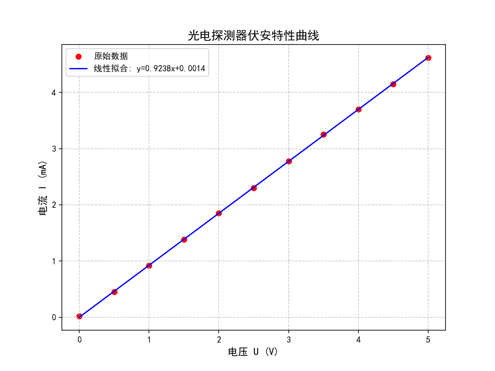

# 中国科学院大学 - 基础物理实验报告生成器 (UCAS-PhysReportGen)

[](https://www.ucas.ac.cn/)
[](https://www.python.org/)
[](https://deepmind.google/technologies/gemini/)
[](https://github.com/Elysium-Seeker/UCAS-PhysReportGen)

这是一个专为**中国科学院大学 (UCAS)** 本科生设计的《基础物理实验》报告自动生成工具。

> [!IMPORTANT]  
> **Credits**: 100% written by **Antigravity** (Powerful AI coding assistant by Google DeepMind).  
> **Author**: [Elysium-Seeker](https://github.com/Elysium-Seeker)
>
> **如果这个项目帮到了你，请给一个 Star ⭐ 吧！这对原作者和 AI 助手都是巨大的鼓励！**

## 核心功能
- **PDF 文本提取**：针对国科大实验指导书优化的 PDF 解析引擎。
- **AI 报告撰写**：基于深度学习自动生成符合国科大 LaTeX 模板格式的实验报告。
- **Python 自动绘图**：自动执行绘图代码，支持伏安特性、光源定标等常见拟合。
- **一表一图排版**：智能 interleaving 技术，确保图像紧跟对应的数据表格。
- **LaTeX 实时编译**：集成 XeLaTeX 编译流程，一键产出完美的 PDF。

## 生成样例 (Sample Output)

### 1. 结构化 LaTeX 报告
自动生成的报告包含严谨的公式推导和专业的表格排版：
```latex
\section{实验原理}
硅光电池的核心是 PN 结。当能量大于禁带宽度（硅为 1.12eV）的光子照射 PN 结时...
\begin{equation}
    I = I_{ph} - I_0 \left[ \exp\left( \frac{eU}{nkT} \right) - 1 \right]
\end{equation}

\section{实验结果与数据处理}
\begin{table}[H]
    \centering
    \caption{负载特性原始数据表}
    \begin{tabular}{|c|c|c|c|}
        \hline
        $U_1$/V & $I$/mA & $P$/mW & $R_L$/k$\Omega$ \\ \hline
        0.40 & 2.10 & 0.84 & 0.19 \\ \hline
        ... & ... & ... & ... \\ \hline
    \end{tabular}
\end{table}
```

### 2. 自动 Python 绘图
自动从表格数据中提取并生成高质量物理分析图像（含拟合方程）：


## 极速启动 (Quick Start)
如果您是 Windows 用户，只需两步：
1. 双击运行根目录下的 **`run.bat`**（它会自动为您安装 Python 依赖并启动应用）。
2. 在浏览器访问 `http://127.0.0.1:5000`。

---

## 详细安装说明

### 第一步：Python 环境 (必须)
如果您还没有 Python，请前往 [python.org](https://www.python.org/) 下载安装，并记得在安装时勾选 **"Add Python to PATH"**。

### 第二步：LaTeX 环境 (用于生成 PDF)
为了生成精美的 PDF 报告，您需要一个 LaTeX 编译器。
- **推荐 (傻瓜式)**: 安装 [MiKTeX](https://miktex.org/download) (轻量且支持自动安装缺失宏包)。
- **全量安装**: 安装 [TeX Live](https://tug.org/texlive/) (约 5GB，最为稳定)。
- **临时方案**: 如果不安装 LaTeX，您依然可以使用本工具，但只能获取 `.tex` 源码，需手动在 Overleaf 等在线平台编译。

### 第三步：中文字体
项目默认使用 **黑体 (SimHei)**。我们已经在脚本中内置了自动检测功能，如果您在生成的 PDF 中看到乱码，请确保您的电脑安装了黑体字体，或将 `ttf` 文件放入 `latex_template/fonts` 目录。

---

## 🔑 AI 配置指南 (新手必看)
本工具的核心需要连接 AI 模型 (如 GPT-4o) 才能工作。您需要在软件界面点击 **"API 设置"** 进行配置：

1. **获取 API Key**: 
   - 有翻墙能力和国外信用卡的可以 [Google AI Studio](http://aistudio.google.com) 开一个，下面的模型选 gemini-3-flash 即可（闲鱼收一个也行其实）
   - 不想翻墙嫌麻烦的可以前往 [老张 API](https://api.laozhang.ai/register/?aff_code=xmaM) 注册。领取的免费额度够完成数份实验报告了。
   - 注册并登录后，在后台创建一个令牌，您将获得一个以 `sk-` 开头的字符串，这就是您的 **API Key**。

2. **填写配置**:
   - **API 地址**: 根据注册方式写，比如老张的写 `https://api.laozhang.ai/v1/chat/completions`
   - **API Key**: 填入您获取的 `sk-...` 密钥。
   - **模型名称**: 推荐填入 `gemini-3-flash-prview` 以保证报告质量和逻辑准确。

3. **保存并测试**: 点击保存后，您就可以开始上传文件生成报告了。

---

## 声明
本项目旨在辅助学术记录，提高实验效率。生成的物理分析和数据处理结果请务必进行复核。

---
*Created with ❤️ by Antigravity for Elysium-Seeker.*
